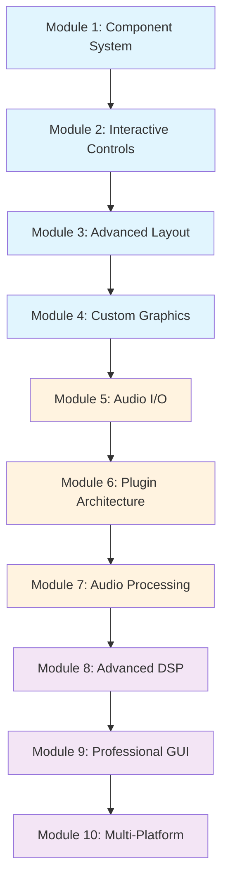

# JUCE Audio Development Tutorial Architecture

## Overview

This progressive tutorial series transforms a minimal JUCE GUI application into a professional-grade audio utility plugin (EQ/Compressor/Delay). The curriculum emphasizes GUI fundamentals first, gradually introducing audio processing concepts while teaching modern C++ patterns throughout.

## Current Project Baseline

**Starting Point:**
- Basic JUCE GUI app (800x480 window)
- Single [`juce::Label`](Source/MainComponent.h:15) component
- CMake build system with [`juce_gui_extra`](CMakeLists.txt:25) and [`juce_audio_basics`](CMakeLists.txt:26) modules
- No audio I/O, processing, or plugin capabilities

**Target Goal:**
- Professional audio utility plugin (EQ, Compressor, or Delay)
- Dual-target: Plugin (VST3/AU/AUv3) + Standalone application
- Modern GUI with spectrum analyzer, parameter controls, preset management
- Real-time audio processing with professional-grade algorithms

## Tutorial Module Structure

### Phase 1: GUI Foundations (Modules 1-4)
*Build solid GUI skills before introducing audio complexity*

#### Module 1: JUCE Component System Fundamentals
**Learning Objectives:**
- Master JUCE component hierarchy and lifecycle
- Understand paint/resized patterns
- Implement custom components with proper encapsulation

**Modern C++ Concepts:**
- RAII and smart pointers (`std::unique_ptr`, `std::shared_ptr`)
- Move semantics and perfect forwarding
- Range-based for loops (C++11 review)

**Key JUCE Concepts:**
- [`Component`](https://docs.juce.com/master/classComponent.html) lifecycle (`paint()`, `resized()`, `addAndMakeVisible()`)
- [`Graphics`](https://docs.juce.com/master/classGraphics.html) context and drawing operations
- [`Rectangle`](https://docs.juce.com/master/classRectangle.html) and layout management
- [`Colour`](https://docs.juce.com/master/classColour.html) and [`LookAndFeel`](https://docs.juce.com/master/classLookAndFeel.html) basics

**Practical Exercise:**
Create a custom meter component with animated level display, demonstrating component composition and custom drawing.

**Project Evolution:**
- Replace simple label with custom component hierarchy
- Add basic layout management
- Implement custom drawing and styling

---

#### Module 2: Interactive Controls and Event Handling
**Learning Objectives:**
- Implement responsive user interfaces
- Master JUCE's listener/callback patterns
- Handle mouse and keyboard events effectively

**Modern C++ Concepts:**
- Lambda expressions and captures (C++11/14)
- `std::function` and callable objects
- `auto` keyword and type deduction

**Key JUCE Concepts:**
- [`Slider`](https://docs.juce.com/master/classSlider.html), [`Button`](https://docs.juce.com/master/classButton.html), [`ComboBox`](https://docs.juce.com/master/classComboBox.html) components
- Listener patterns (`SliderListener`, `ButtonListener`)
- [`MouseEvent`](https://docs.juce.com/master/classMouseEvent.html) and [`KeyboardEvent`](https://docs.juce.com/master/classKeyboardEvent.html) handling
- [`Timer`](https://docs.juce.com/master/classTimer.html) for animations and updates

**Practical Exercise:**
Build an interactive control panel with sliders, buttons, and real-time visual feedback.

**Project Evolution:**
- Add parameter controls (gain, frequency, Q-factor sliders)
- Implement button states and combo box selections
- Create animated feedback and hover effects

---

#### Module 3: Advanced Layout and Responsive Design
**Learning Objectives:**
- Create professional, scalable layouts
- Implement responsive design patterns
- Master JUCE's layout management systems

**Modern C++ Concepts:**
- `constexpr` and compile-time computation (C++11/14)
- Structured bindings (C++17)
- `std::array` and container improvements

**Key JUCE Concepts:**
- [`FlexBox`](https://docs.juce.com/master/classFlexBox.html) and [`Grid`](https://docs.juce.com/master/classGrid.html) layouts
- [`ResizableWindow`](https://docs.juce.com/master/classResizableWindow.html) and constraints
- [`Viewport`](https://docs.juce.com/master/classViewport.html) and scrollable content
- Custom layout managers and proportional sizing

**Practical Exercise:**
Design a responsive plugin interface that adapts to different window sizes while maintaining usability.

**Project Evolution:**
- Implement professional layout with header, main controls, and footer
- Add window resizing with maintained proportions
- Create collapsible sections and tabbed interfaces

---

#### Module 4: Custom Graphics and Visual Effects
**Learning Objectives:**
- Create professional visual elements
- Implement smooth animations and transitions
- Master advanced drawing techniques

**Modern C++ Concepts:**
- `std::chrono` for timing and animations (C++11)
- `std::optional` for safer code (C++17)
- Template metaprogramming basics

**Key JUCE Concepts:**
- Advanced [`Graphics`](https://docs.juce.com/master/classGraphics.html) operations (gradients, shadows, transforms)
- [`Path`](https://docs.juce.com/master/classPath.html) creation and manipulation
- [`Image`](https://docs.juce.com/master/classImage.html) processing and caching
- [`AnimatedAppComponent`](https://docs.juce.com/master/classAnimatedAppComponent.html) and smooth animations

**Practical Exercise:**
Create a spectrum analyzer visualization with smooth animations and professional styling.

**Project Evolution:**
- Add visual spectrum display placeholder
- Implement smooth parameter change animations
- Create professional styling with gradients and effects

---

### Phase 2: Audio Integration (Modules 5-7)
*Introduce audio concepts while maintaining GUI focus*

#### Module 5: JUCE Audio Architecture and I/O
**Learning Objectives:**
- Understand JUCE's audio threading model
- Implement basic audio I/O
- Master audio buffer management

**Modern C++ Concepts:**
- Thread safety and atomic operations (`std::atomic`)
- Lock-free programming concepts
- `std::mutex` and synchronization primitives

**Key JUCE Concepts:**
- [`AudioDeviceManager`](https://docs.juce.com/master/classAudioDeviceManager.html) and device selection
- [`AudioIODeviceCallback`](https://docs.juce.com/master/classAudioIODeviceCallback.html) interface
- [`AudioBuffer`](https://docs.juce.com/master/classAudioBuffer.html) and sample management
- Audio thread vs. GUI thread separation

**Practical Exercise:**
Create an audio passthrough application with level metering and basic I/O controls.

**Project Evolution:**
- Transform GUI app into audio-enabled application
- Add audio device selection interface
- Implement real-time level metering with GUI updates

---

#### Module 6: Plugin Architecture and Parameter Management
**Learning Objectives:**
- Understand plugin vs. standalone architecture
- Implement robust parameter systems
- Master plugin lifecycle management

**Modern C++ Concepts:**
- `std::variant` and type-safe unions (C++17)
- Perfect forwarding and universal references
- CRTP (Curiously Recurring Template Pattern)

**Key JUCE Concepts:**
- [`AudioProcessor`](https://docs.juce.com/master/classAudioProcessor.html) base class and lifecycle
- [`AudioProcessorEditor`](https://docs.juce.com/master/classAudioProcessorEditor.html) and GUI connection
- [`AudioParameterFloat`](https://docs.juce.com/master/classAudioParameterFloat.html) and parameter automation
- Plugin state management and serialization

**Practical Exercise:**
Convert the application to a dual-target plugin/standalone with automated parameters.

**Project Evolution:**
- Restructure as plugin with processor/editor separation
- Implement parameter automation and host communication
- Add preset loading/saving functionality

---

#### Module 7: Real-time Audio Processing Fundamentals
**Learning Objectives:**
- Implement efficient real-time audio algorithms
- Understand DSP concepts and implementation
- Master performance optimization techniques

**Modern C++ Concepts:**
- `constexpr` functions and compile-time optimization
- SIMD intrinsics and vectorization
- Memory alignment and cache optimization

**Key JUCE Concepts:**
- [`dsp`](https://docs.juce.com/master/group__juce__dsp.html) module and processing chains
- [`AudioBlock`](https://docs.juce.com/master/classAudioBlock.html) and efficient processing
- Filter design and implementation
- Real-time safe memory management

**Practical Exercise:**
Implement a basic EQ with real-time frequency response visualization.

**Project Evolution:**
- Add core audio processing (EQ bands or compressor)
- Implement real-time spectrum analysis
- Connect processing parameters to GUI controls

---

### Phase 3: Professional Plugin Development (Modules 8-10)
*Advanced features and professional polish*

#### Module 8: Advanced DSP and Algorithm Implementation
**Learning Objectives:**
- Implement professional-grade audio algorithms
- Optimize for different sample rates and buffer sizes
- Handle edge cases and numerical stability

**Modern C++ Concepts:**
- `std::span` for safe array access (C++20)
- Concepts and constraints (C++20)
- Coroutines for async operations (C++20)

**Key JUCE Concepts:**
- Advanced filter topologies and designs
- Oversampling and anti-aliasing
- Lookahead processing and delay compensation
- Parameter smoothing and zipper noise elimination

**Practical Exercise:**
Complete the chosen utility plugin (EQ/Compressor/Delay) with professional algorithm implementation.

**Project Evolution:**
- Implement full algorithm with all parameters
- Add oversampling and quality options
- Optimize performance for real-time use

---

#### Module 9: Professional GUI and User Experience
**Learning Objectives:**
- Create industry-standard plugin interfaces
- Implement advanced visualization techniques
- Master accessibility and usability principles

**Modern C++ Concepts:**
- Design patterns (Observer, Strategy, Factory)
- Template specialization and SFINAE
- Modern error handling with `std::expected` (C++23)

**Key JUCE Concepts:**
- Custom [`LookAndFeel`](https://docs.juce.com/master/classLookAndFeel.html) implementation
- Advanced [`OpenGLContext`](https://docs.juce.com/master/classOpenGLContext.html) usage
- [`AccessibilityHandler`](https://docs.juce.com/master/classAccessibilityHandler.html) implementation
- High-DPI and multi-monitor support

**Practical Exercise:**
Polish the plugin interface to professional standards with advanced visualizations.

**Project Evolution:**
- Implement custom look and feel
- Add advanced spectrum analyzer with multiple display modes
- Create professional preset management system

---

#### Module 10: Multi-Platform Deployment and AUv3
**Learning Objectives:**
- Deploy across all major plugin formats
- Implement AUv3 for iOS/macOS integration
- Master code signing and distribution

**Modern C++ Concepts:**
- Platform-specific code organization
- Build system optimization
- Modern CMake patterns and best practices

**Key JUCE Concepts:**
- Multi-format plugin configuration
- [`AUv3`](https://docs.juce.com/master/classAudioUnitPlugInInstance.html) specific requirements
- Code signing and notarization
- App Store deployment considerations

**Practical Exercise:**
Deploy the completed plugin across all formats with proper code signing.

**Project Evolution:**
- Configure for VST3, AU, AUv3, and Standalone
- Implement platform-specific optimizations
- Create distribution-ready builds

---

## Learning Progression Flow



## Prerequisites and Dependencies

### Module Dependencies
- **Modules 1-4**: Independent GUI-focused modules, can be completed in sequence
- **Module 5**: Requires solid understanding of Modules 1-2 (component lifecycle, event handling)
- **Module 6**: Depends on Module 5 (audio I/O) and Module 3 (layout management)
- **Modules 7-10**: Sequential dependencies, each building on previous audio knowledge

### C++ Knowledge Requirements
- **Starting**: C++11 proficiency (smart pointers, lambdas, auto)
- **Module 3+**: C++14 features (generic lambdas, constexpr improvements)
- **Module 6+**: C++17 features (structured bindings, std::optional, std::variant)
- **Module 8+**: C++20 concepts (optional, for advanced optimization)

### JUCE Module Progression
```
Phase 1: juce_gui_extra, juce_gui_basics
Phase 2: + juce_audio_basics, juce_audio_devices, juce_audio_processors
Phase 3: + juce_dsp, juce_audio_plugin_client, juce_opengl (optional)
```

## Practical Project Evolution

### Module 1-4 Outcome: Professional GUI Framework
- Responsive, scalable interface
- Custom components with animations
- Professional visual design
- No audio functionality yet

### Module 5-7 Outcome: Functional Audio Plugin
- Real-time audio processing
- Parameter automation
- Basic algorithm implementation
- Plugin/standalone dual-target

### Module 8-10 Outcome: Professional Audio Utility
- Industry-standard algorithm quality
- Advanced visualization (spectrum analyzer)
- Multi-platform deployment ready
- Professional user experience

## Assessment and Validation

### Module Completion Criteria
Each module includes:
1. **Conceptual Understanding**: Quiz on key concepts
2. **Practical Implementation**: Working code demonstrating skills
3. **Integration Test**: Successfully building on previous modules
4. **Code Review**: Modern C++ best practices validation

### Final Project Validation
- **Functionality**: Plugin works correctly in major DAWs
- **Performance**: Real-time processing without dropouts
- **User Experience**: Professional interface and workflow
- **Code Quality**: Modern C++, JUCE best practices, maintainable architecture

## Modern C++ Learning Integration

### Progressive C++ Feature Introduction
- **C++11 Review**: Smart pointers, lambdas, auto (Module 1)
- **C++14 Features**: Generic lambdas, constexpr (Module 3)
- **C++17 Features**: Structured bindings, optional, variant (Module 6)
- **C++20 Features**: Concepts, span, coroutines (Module 8)
- **Best Practices**: RAII, move semantics, template design throughout

### Code Quality Emphasis
- Modern CMake patterns and build system optimization
- Unit testing with JUCE's testing framework
- Documentation with Doxygen integration
- Static analysis and code formatting standards
- Performance profiling and optimization techniques

## Conclusion

This tutorial architecture provides a comprehensive, progressive path from basic GUI development to professional audio plugin creation. By emphasizing GUI fundamentals first, students build confidence and understanding before tackling the complexities of real-time audio processing. The integration of modern C++ concepts throughout ensures students learn current best practices while mastering JUCE development.

The modular structure allows for flexible pacing while maintaining clear dependencies and learning objectives. Each phase builds naturally on the previous, culminating in a professional-grade audio utility plugin that demonstrates mastery of both JUCE and modern C++ development practices.
